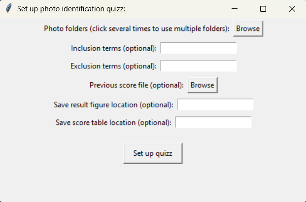
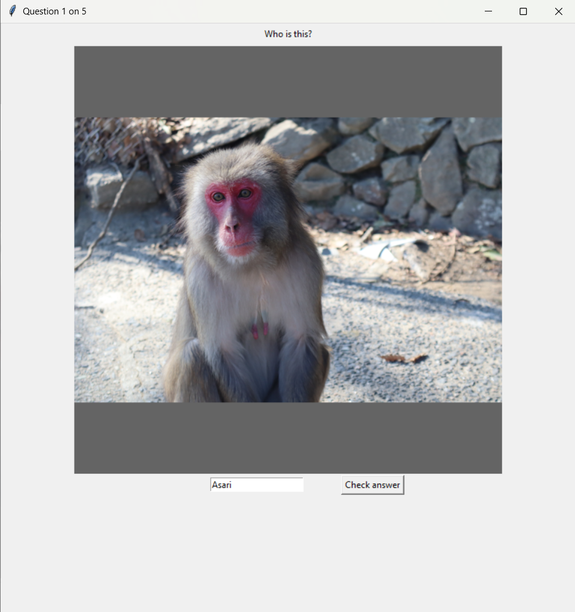
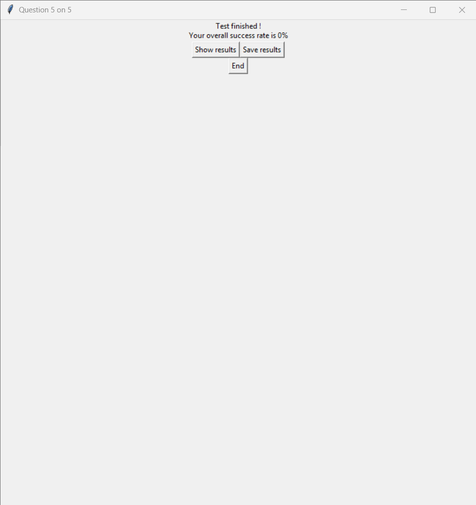
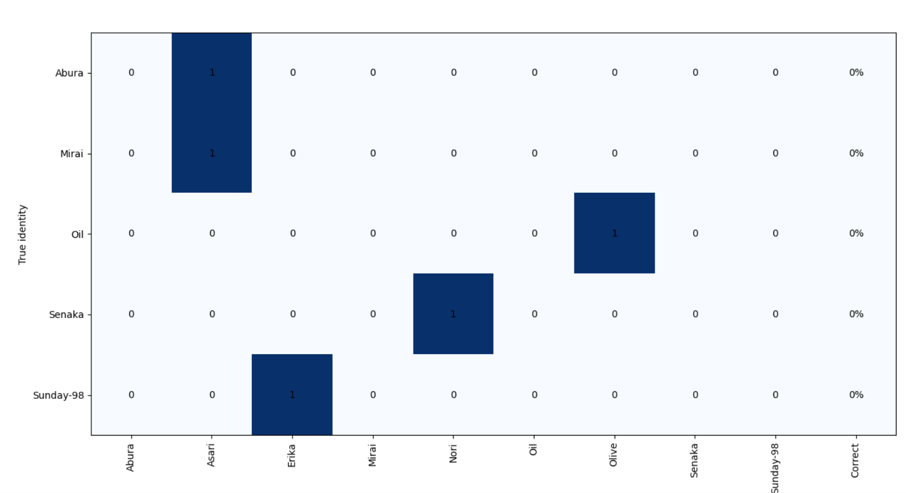

# PhotoID

Python-based GUI to train for animal individual identification.
The module can work with any set of photographs, as long as the name of each photograph starts with the individual name followed by an underscore.
The module includes a score tracking and visualisation system.

## Tutorial

Download photoID.py, install the requires packages `pip install -r requirements.txt`, and run python in the same folder as the photoID.py file.

### Full GUI mode

The module include GUI to set up the photoID quizz.
```
import photoID as pid

my_quizz = pid.Quizz()  # Create Quizz instance.
my_quizz.config()  # GUI configuration.
```



```
my_quizz.choose_photos()  # Prepare quizz resources based on parameters.
my_quizz.start_quizz(n=5)  # Runs quizz.
```





```
# The whole procedure can be run with a single line:
pid.photo_quizz(n=5)
```

For some reason, running `pid.photo_quizz` displays an error message in the console. I will look into matplotlib to understand why.
However, is is possible to continue with the quizz with no issue.

### Manual mode

It is also possible to configure the quizz manually.

```
import photoID as pid

# Set up all parameters manually:
#    - folders, incl, and excl for photo selection
#     - n for number of questions in the quizz
#    - score to load previous test results
#    - fig and tab to save results

my_quizz = pid.Quizz(folders=folders, incl=incl, excl=excl, fig=out_f, tab=out_t)
my_quizz.choose_photos()
my_quizz.start_quizz(n=n)

# Single line is possible.
pid.photo_quizz(folders=None, incl=None, excl=None,
                n=None,
                score=None,
                out_f=None, out_t=None
                )
```

### Standalone questions.

You can ask questions one by one instead of launching a full quizz.

```
import photoID as pid

my_quizz = pid.Quizz(folders=folders, incl=incl, excl=excl, fig=out_f, tab=out_t)
my_quizz.choose_photos()

my_quizz.start_quizz()  # If n is not provided, the quizz does not start.

#  Random question.
pid.Question(my_quizz)
# Question about a specific individual (useful to learn specific features
# from multiple photographs).
pid.Question(my_quizz, ind=ind)
```
